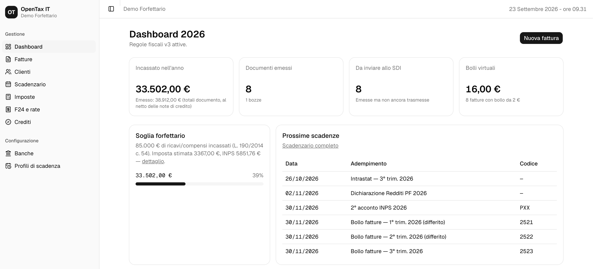

# OpenTax IT

Gestionale **open source** (`opentax-it`) per partite IVA italiane in **regime forfettario** (L. 190/2014, art. 1 c. 54-89):

- fatture e note di credito in formato **FatturaPA** (XML), invio allo **SDI via PEC** (nessun provider a pagamento, nessun accreditamento);
- **principio di cassa**: emesso vs incassato, reddito imponibile calcolato sugli incassi dell'anno;
- **scadenzario**: saldo, acconti (40/60), rate mensili fino al 16 dicembre, INPS Gestione Separata, imposta di bollo trimestrale;
- **libro mastro crediti/compensazioni** (credito da dichiarazione → F24 che lo usano → residuo);
- preparazione F24 per rata, pensati per l'addebito a date future (**I24**) da inviare con F24 web;
- registro degli **avvisi/comunicazioni** (CIVIS) e delle relative rate;
- **regole fiscali versionate per anno** (`FiscalRuleSet`): niente valori hardcodati; un job controlla periodicamente le fonti ufficiali (AdE, INPS, GU/Normattiva, ADM) e propone le modifiche all'amministratore, che le attiva esplicitamente;
- schema **multi-tenant** fin dall'inizio.



> **Avvertenza.** Questo software è uno strumento di supporto al calcolo e all'organizzazione: **non è consulenza fiscale** e non sostituisce un professionista abilitato. **Non si garantisce la veridicità né la correttezza dei dati e dei calcoli prodotti: la responsabilità del loro uso è esclusivamente dell'utilizzatore.** Le regole fiscali cambiano ogni anno; verifica sempre i valori attivi con le fonti ufficiali. Gli autori e i contributori non rispondono di errori di calcolo, sanzioni o omissioni derivanti dall'uso del software: vedi [DISCLAIMER.md](DISCLAIMER.md) e [LICENSE](LICENSE), sez. 15-16.

## Stato

Fase iniziale. Ogni feature è ancorata a una fonte ufficiale: vedi [docs/compliance.md](docs/compliance.md). Funziona: set di regole 2025 e 2026 (`packages/fiscal-rules`, con fonti), attivazione manuale da `/setup`, scadenzario (`/deadlines`), anagrafica clienti, fatture e note di credito con emissione e XML FatturaPA validato (`/invoices`), import di XML emessi altrove, incassi per cassa, calcolo imposta sostitutiva/INPS e acconti (`/taxes`), piano rate e deleghe F24 con stato e stampa sul modello ufficiale (`/f24`). Compensazione dei crediti in F24 (`/credits`). Cosa manca, per epiche: [TODO.md](TODO.md) (in testa: autenticazione e invio PEC allo SDI). Regola per chi contribuisce: solo fonti ufficiali verificate, nessuna assunzione ([CONTRIBUTING.md](CONTRIBUTING.md)). Le fonti normative verificate (aggiornate al 2026) sono in [docs/normativa-2026.md](docs/normativa-2026.md); il design del monitoraggio normativo in [docs/monitoraggio-normativo.md](docs/monitoraggio-normativo.md).

## Struttura

```
apps/api       NestJS + Prisma (PostgreSQL)
apps/web       React + Vite
packages/fiscal-rules   regole fiscali pure (TypeScript), testate, con riferimento normativo
packages/fatturapa      generatore XML FatturaPA validato contro l'XSD ufficiale
docs/          normativa, design
```

## Avvio rapido

Requisiti: Node ≥ 22, pnpm 10, Docker.

```bash
pnpm install
cp .env.example .env
pnpm db:up          # PostgreSQL in Docker
pnpm db:migrate     # schema Prisma
pnpm dev            # api (http://localhost:3000/api) + web (http://localhost:3001)
```

Per vedere il flusso con dati inventati: `pnpm demo:seed` (con `pnpm dev` attivo) crea la partita IVA "Demo Forfettario" con clienti, fatture e incassi dell'anno scorso e di quest'anno; selezionala in `/setup` e apri `/taxes` e `/f24`.

Al primo avvio apri http://localhost:3001/setup: crea la partita IVA (profilo fiscale, banche, profili di scadenza) e, nella sezione **Regole fiscali**, carica il set fornito con l'applicazione e attivalo. Lo stesso vale ogni volta che un aggiornamento del codice porta un nuovo set: viene proposto come nuova versione in bozza e non è mai attivato automaticamente.

## Contribuire

Leggi [CONTRIBUTING.md](CONTRIBUTING.md): si lavora solo su fonti ufficiali verificate, nessuna assunzione. Ogni regola fiscale deve citare la fonte ufficiale (norma, provvedimento, circolare) nel codice e nei test.

## Cosa manca

La lista dei lavori aperti, per epiche e con le fonti da cui partire, è in [TODO.md](TODO.md). I punti verificabili ma ancora senza fonte sono in [docs/compliance.md](docs/compliance.md), sezione "Non verificato / aperto".

## Licenza

[AGPL-3.0-only](LICENSE). Se modifichi il software e lo offri come servizio in rete, devi rendere disponibile il codice sorgente modificato agli utenti del servizio.
